# Forever Project

This is a React-based e-commerce web application. The project aims to provide a modern and responsive online shopping experience.

##  Technologies Used

- **Frontend:**
  - React.js
  - JavaScript
  - Tailwind CSS for styling
- **State Management:** React Context API
- **Routing:** React Router

##  Features

- Fully responsive design for mobile, tablet, and desktop
- Browse products by categories
- Add products to cart and manage cart items
- interactive UI elements using Tailwind CSS

##  Getting Started

Follow these steps to run the project locally:

1. **Clone the repository:**
   ```bash
   git clone https://github.com/alaafawzyyyy/e-commerce

2. **Navigate to the project folder:**
   ```bash
    cd e-commerce

3. **Install dependencies:**
   ```bash
    npm install

4. **Start the development server:**
   ```bash
    npm run dev

## Screenshots
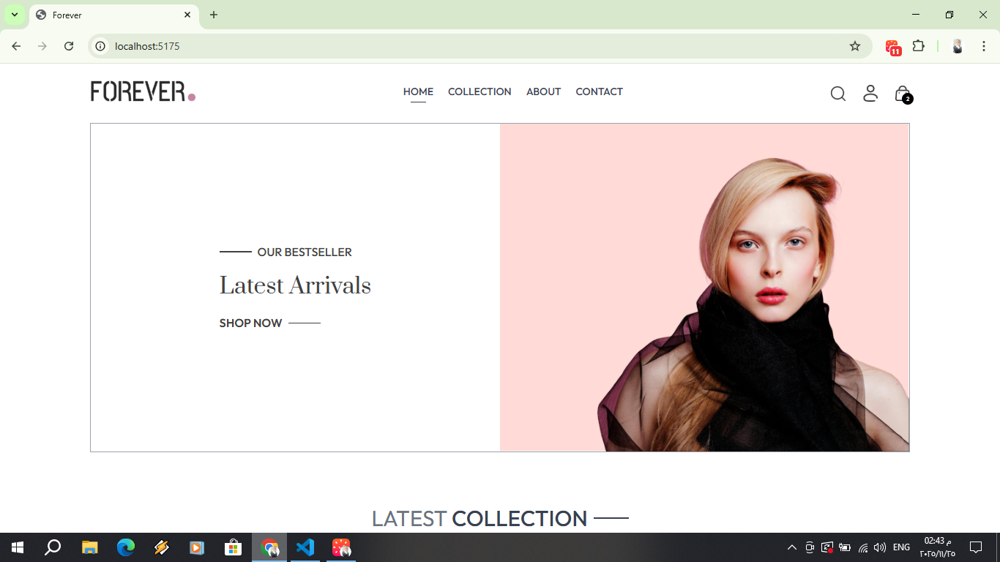
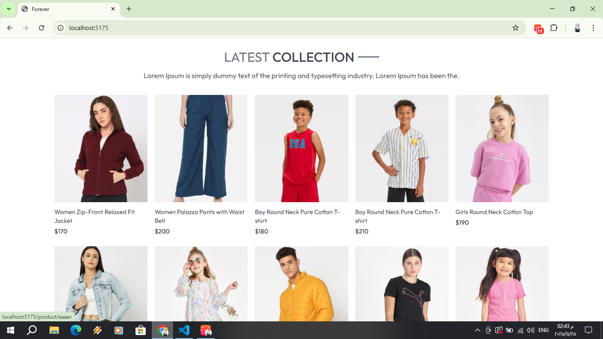


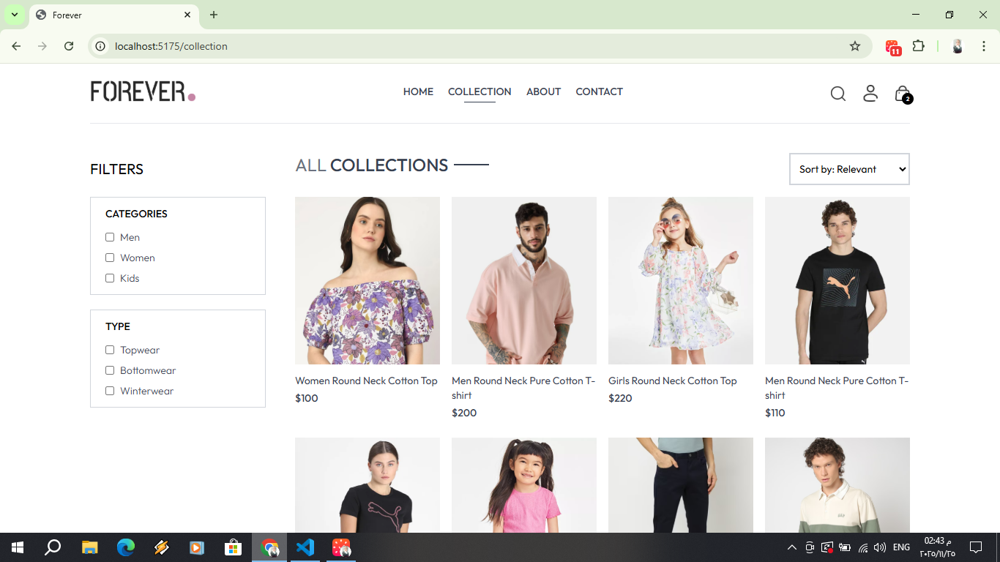
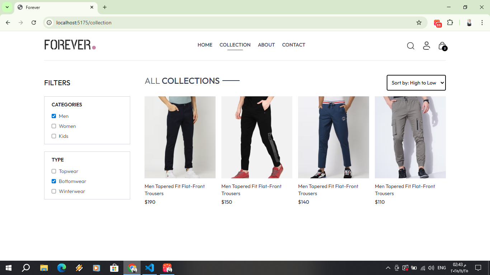
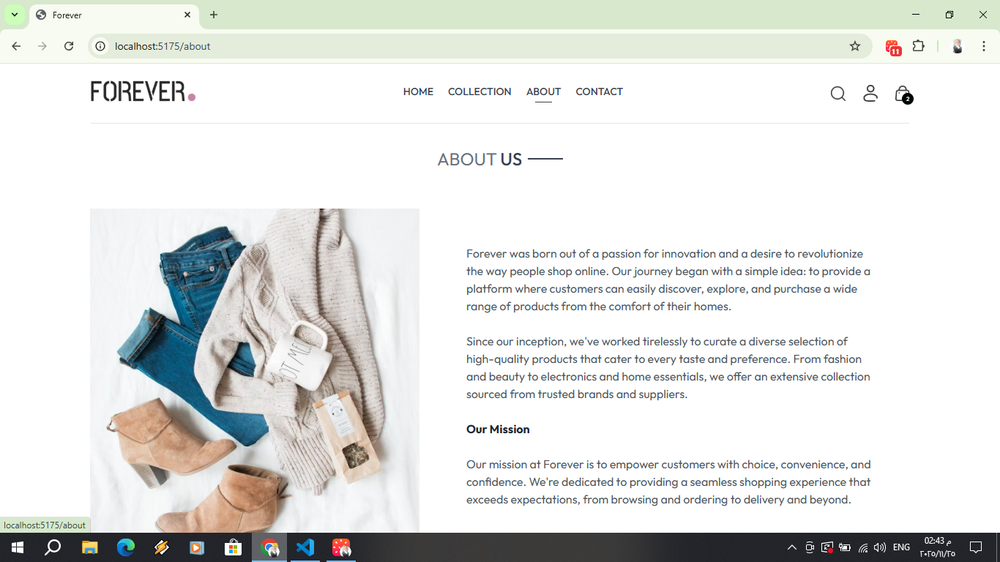
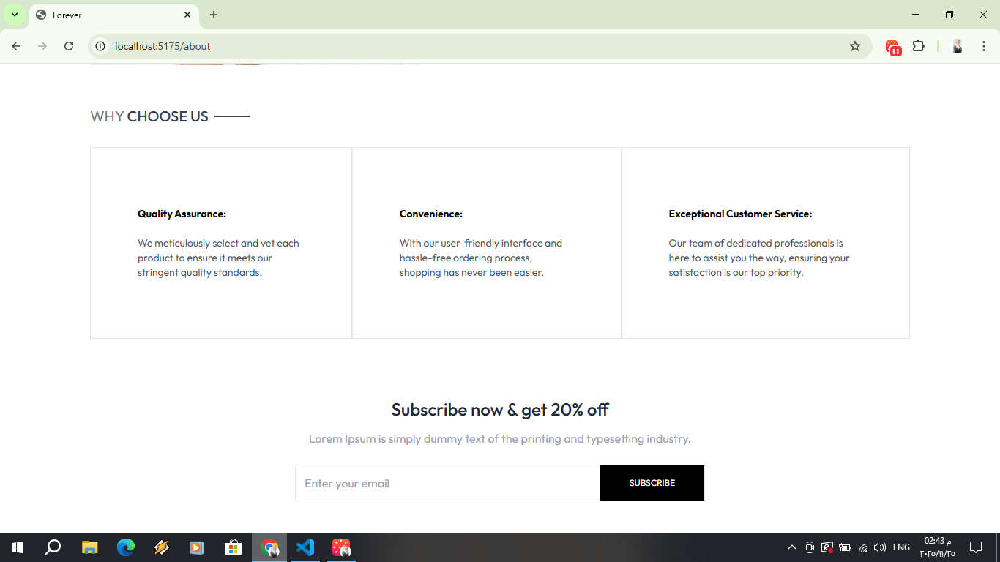
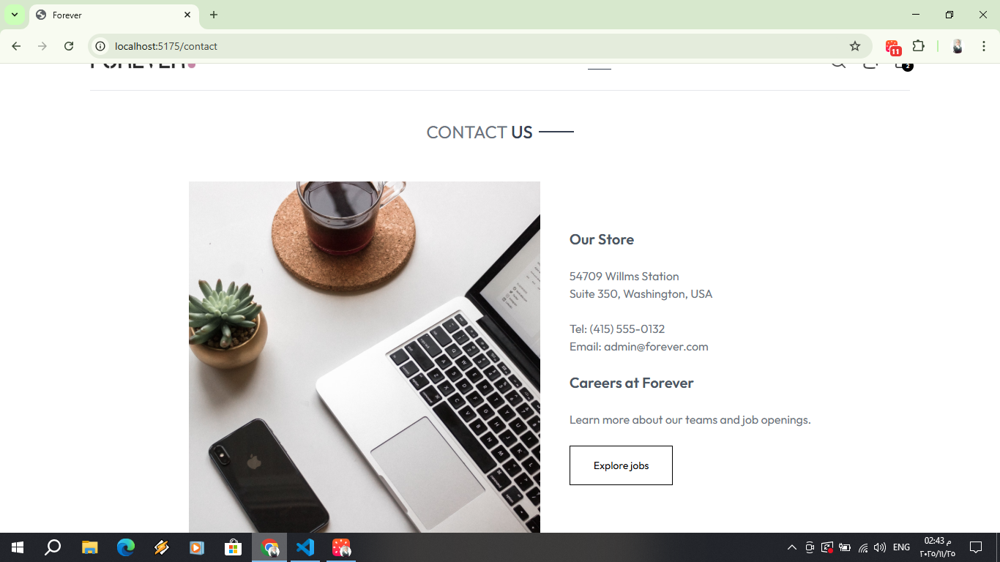
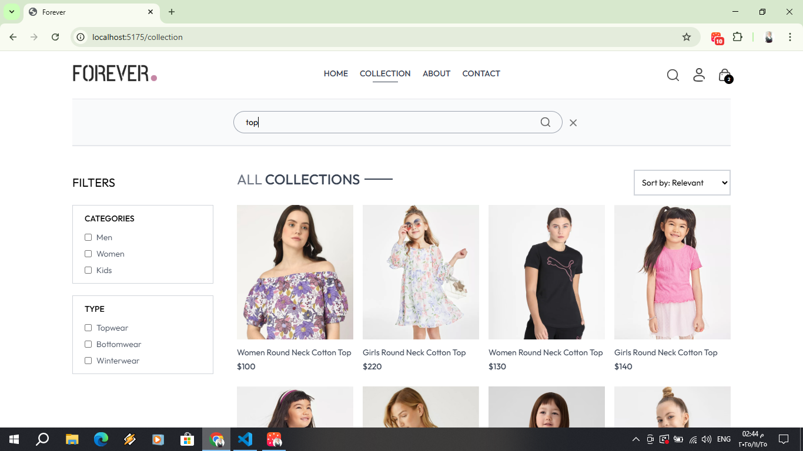
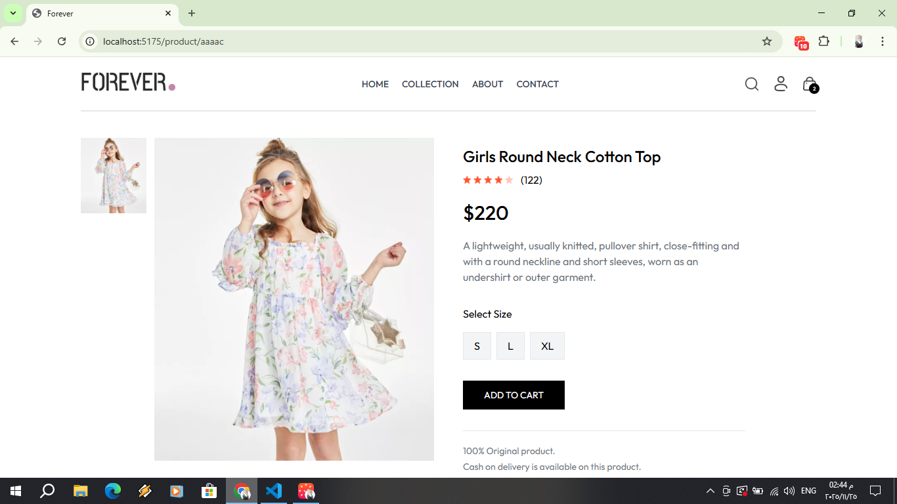
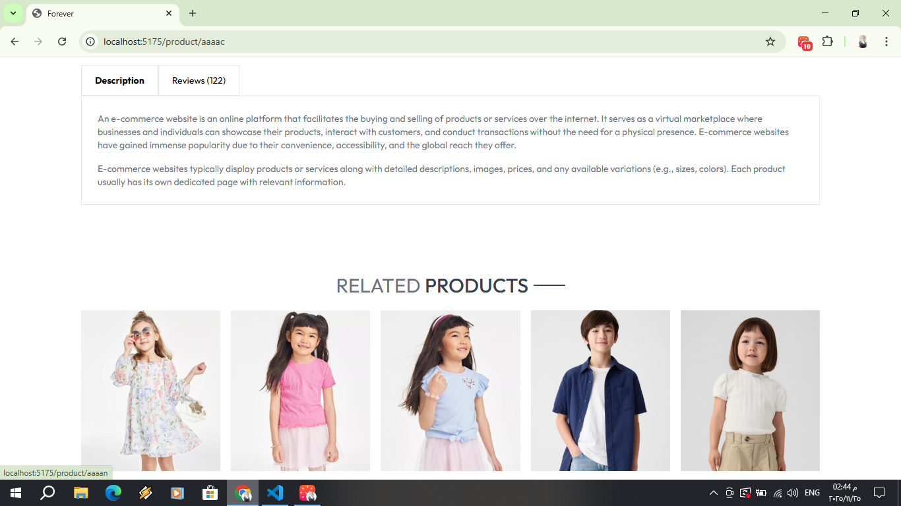
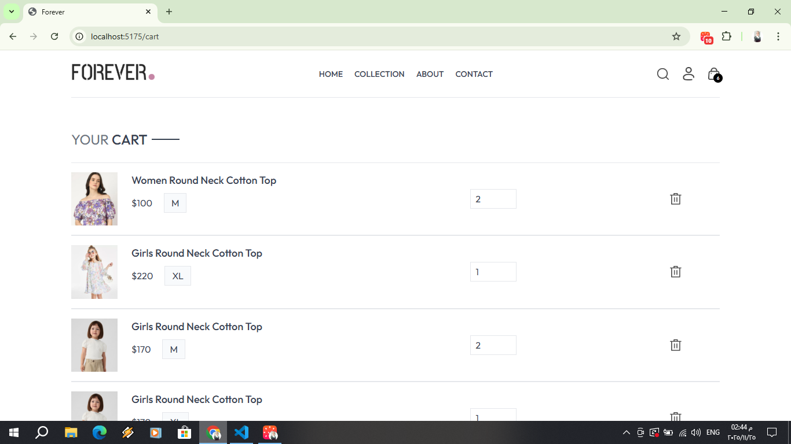
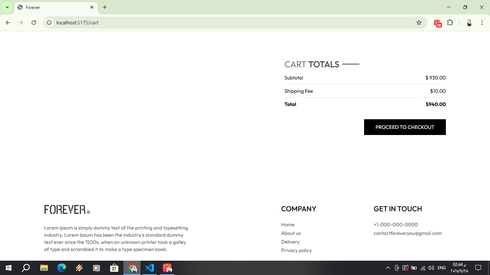
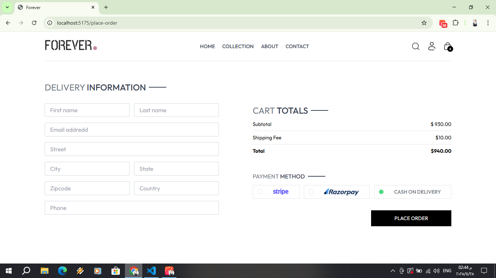
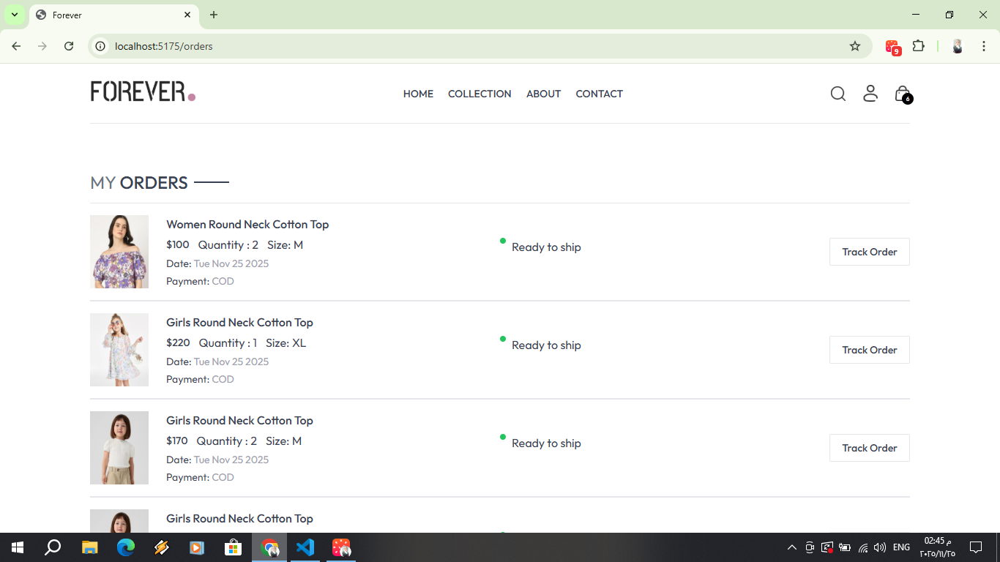
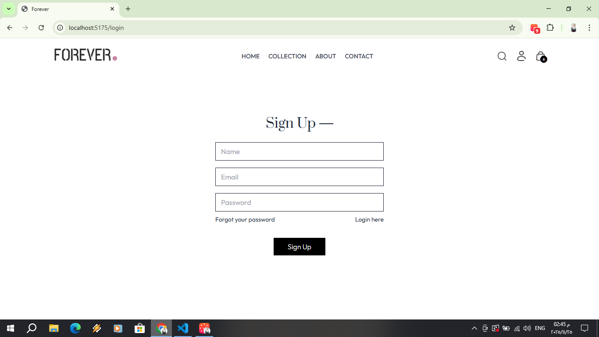
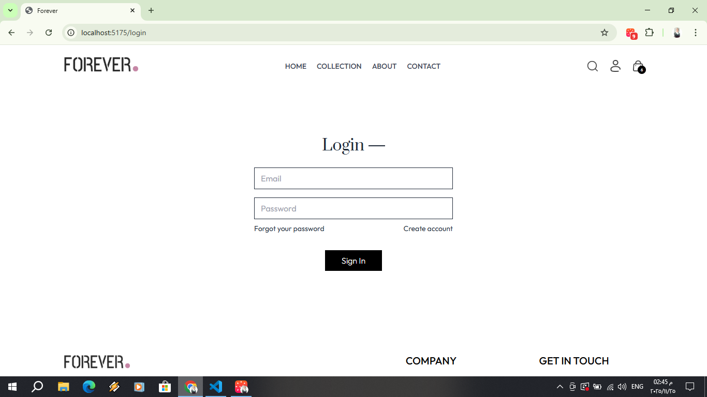

